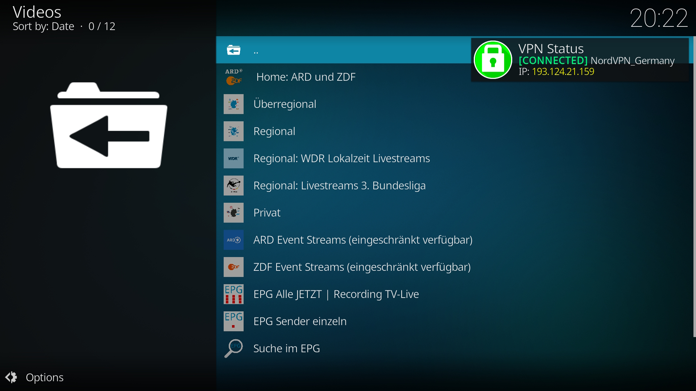

---
# WireGuard Manager for NordVPN (LibreELEC)
-blue?logo=kodi)

---
A lightweight, high-performance Kodi service addon for **LibreELEC 12+ (Kodi 21 Omega)**. This tool manages WireGuard connections natively via `connmanctl`, providing a faster and more stable experience than traditional OpenVPN-based addons.
## 🚀 Features
*   **Native WireGuard**: Interfaces directly with LibreELEC's network stack for maximum speed and minimal overhead.
*   **Raspberry Pi 5 Optimized**: Specifically tuned timing profiles and multi-threaded execution reduce VPN switching and recovery times.
*   **1Hz Physical Watchdog**: A standalone `systemd` service monitors hardware carrier status every second for near-instant detection of cable pulls or link loss.
*   **Aggressive Stream Recovery**: Automatically kills "frozen" video players during network blackouts to prevent UI hangs and provide immediate error feedback.
*   **Intelligent Throttling**: Implements a "Safety Fuse" logic that stands down after 10 failed reconnection attempts to preserve system resources and NordVPN API limits.
*   **Auto-Healing Failover**: Detects physical interface changes (Ethernet <-> Wi-Fi) and automatically resets retry budgets to ensure seamless recovery.
*   **High-Visibility Alerts**: Enhanced Kodi notifications with ARGB color formatting and custom audio cues (`error.wav`) for critical network events.
*   **IPv6 Leak Protection**: Kernel-level hardening and dynamic DNS management prevent data leaks during VPN transitions.
*   **Remote Optimized**: Automatically maps **F11** to trigger the VPN menu from anywhere in Kodi.
*   **Smart Auto-Mappings**: Dynamically switches VPN locations based on the specific Kodi addon or folder being browsed.

## 🛠 Advanced Monitoring
*   **Real-time Logging**: Detailed `PURPOSE` tagging for all system waits, visible via `journalctl` or centralized logs.
*   **Status Persistence**: Tracks active sessions and retry counts via secure temporary state files to survive script restarts.

## 📂 Project Structure
| File/Folder | Description |
| :--- | :--- |
| **`main.py`** | Primary entry point for the GUI and menu logic. |
| **`service_startup.py`** | Kodi Monitor service handling auto-mappings and UI context checks. |
| **`resources/lib/vpn_config.py`** | Centralized configuration for all wait times, paths, and DNS fallbacks. |
| **`resources/lib/service.py`** | Bulletproof, standalone background watchdog running at the OS level. |
| **`resources/lib/reconnect_helper.py`** | Bridge script allowing the OS watchdog to trigger Kodi-aware VPN actions. |
| **`resources/lib/vpn_ops.py`** | Core engine for Connect/Disconnect/Status logic with dependency-safe imports. |
| **`resources/lib/setup_helper.py`** | Manages installation of systemd services, keymaps, and configs. |
| **`resources/lib/network_utils.py`** | Hardens system DNS and manages IPv6 kernel states. |
| **`resources/lib/logger.py`** | Centralized logging utility with dynamic version tagging. |
| **`resources/data/`** | Contains `vpn-watchdog.service`, `connman_main.conf`, and tunnel templates. |
| **`resources/update_servers.sh`** | Bash script utilizing NordVPN APIs to fetch and resolve the latest server IPs. |

## 🛠 Advanced Tuning
All performance timings are centralized in `resources/lib/vpn_config.py`. Users on high-performance hardware like the **Raspberry Pi 5** can adjust variables like `PROP_SYNC_DELAY` and `OS_RELEASE_DELAY` to achieve near-instantaneous connection swaps.

## 📖 Quick Links
For detailed instructions for this Add-on, please visit our **[Wiki](https://github.com/BrodjagaRatnik/service.wireguard.manager/wiki)**:
*   **[🔑 How to get your NordVPN Token](https://github.com/BrodjagaRatnik/service.wireguard.manager/wiki/How-to-get-your-NordVPN-Token)**
*   **[🛠 Editing Installation & Setup](https://github.com/BrodjagaRatnik/service.wireguard.manager/wiki/Installation-&-Setup)**
*   **[⌨️ Shortcuts & Logs](https://github.com/BrodjagaRatnik/service.wireguard.manager/wiki/Shortcuts-&-Logs)**
*   **[🆘 Troubleshooting & Manual Cleanup](https://github.com/BrodjagaRatnik/service.wireguard.manager/wiki/Troubleshooting-&-Manual-Cleanup)**

## 📥 Fast Installation (via Doemela Repo)
If you already know what you're doing, grab the repository installer here:  
**[📦 Download Doemela Repo ZIP](https://github.com/BrodjagaRatnik/doemela-kodi-repo/tree/main/zips/repository.doemela)**

### Step 1: Install the Repository
1. Download the **Doemela Repo ZIP** file to your device (or use a USB stick).
2. Open Kodi and navigate to **Add-ons**.
3. Click the **Box Icon** (Add-on Browser) in the top-left corner.
4. Select **Install from zip file**.
   * *If prompted, click 'Settings' and enable 'Unknown Sources', then go back.*
5. Locate and select the `repository.doemela-x.x.x.zip` file.
6. Wait for the **"Add-on installed"** notification.

### Step 2: Install WireGuard Manager
1. While still in the Add-on Browser, select **Install from repository**.
2. Choose the **Doemela Repo**.
3. Navigate to **Services** > **WireGuard Manager for NordVPN**.
4. Select **Install**.
5. Once the installation is complete, the **Setup Wizard** will launch automatically to guide you through the initial configuration and token import.
> **Tip:** Installing via the Repository is the recommended method. It ensures you receive **automatic updates** for bug fixes and new Raspberry Pi 5 performance optimizations as soon as they are released.
---

---
*Created by Doemela*
