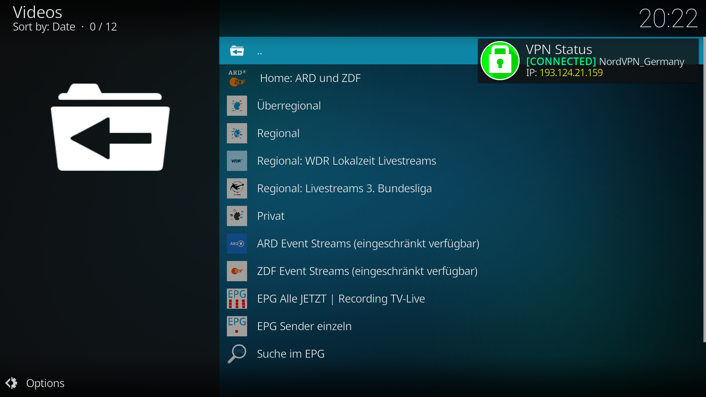

---
# WireGuard VPN Manager

---

A lightweight, high-performance Kodi service addon for **LibreELEC 11, 12, and 13+**. Built entirely in pure Python with a memory-isolated, lazy-loaded architecture, this tool manages WireGuard connections natively via `connmanctl`. It features a zero-leak, kernel-level firewall **killswitch** with automatic LAN whitelisting to guarantee complete data privacy if the tunnel drops. Fully architecture-independent, it provides a rock-solid experience that runs flawlessly on everything from legacy **Raspberry Pi 2 / 3b** hardware to modern **Raspberry Pi 4 / 5** and **x86 HTPC** systems.

## Features

* **Zero-Leak Killswitch**: Kernel-level firewall enforcement via `connmanctl` blocks all WAN traffic instantly if the VPN tunnel drops.
* **LAN Whitelisting**: Maintains local network accessibility (SSH, Samba, local Kodi remotes) even when the killswitch is active.
* **Lazy-Loaded Architecture**: Memory-isolated design imports modules only when needed, maintaining a near-zero idle RAM footprint on low-spec hardware.
* **Native Integration**: Directly commands the LibreELEC network stack without spawning heavy, persistent background sub-processes.
* **Architecture Agnostic**: Written in pure Python; no compiled binary dependencies to break between system updates.

## System Compatibility

| Hardware Platform | LibreELEC Version | Status | Notes |
| :--- | :--- | :--- | :--- |
| **Raspberry Pi 4 / 5** | 11.x, 12.x, 13+ | **Fully Supported** | Optimal performance, near-instant tunnel handshakes. |
| **Raspberry Pi 2 / 3b** | 11.x, 12.x | **Fully Supported** | Highly efficient; verified leak-free on constrained RAM. |
| **Generic x86_64 HTPC** | 11.x, 12.x, 13+ | **Fully Supported** | Works natively with all standard Intel/AMD-based builds. |
| **ARM Boxes (Odroid/Orange Pi)** | 11.x, 12.x, 13+ | **Fully Supported** | Compatible with any LibreELEC image utilizing ConnMan. |

## Requirements

* **OS**: LibreELEC 11.0 or higher (built-in WireGuard kernel module support required).
* **Network**: Active network connection managed via default LibreELEC networking (`connman`).

## Automated Upstream ConnMan FD Leak Mitigation (v1.5.0+)

Older versions of `connmand` contain native tracking bugs within their network cache and DNS proxy layers that trigger when virtual interfaces (like `wg0`) alter default routing metrics. This causes a severe **file descriptor (FD) leak** (approx. 10 FDs/min from the DNS proxy loop, and 2-3 FDs/min from orphaned `CLOSE_WAIT` sockets via `ipv4.connman.net`).

To prevent the system from exhausting resources and crashing, **WGM automatically deploys a system-level optimization on initialization**—requiring zero user intervention or SSH configuration. 

The addon silently injects and applies the following mitigations directly to LibreELEC:
* **Disables ConnMan's Online Check**: Patches `/storage/.config/connman_main.conf` to set `EnableOnlineCheck = false`, stopping orphaned `CLOSE_WAIT` sockets.
* **Bypasses Internal DNS Proxy**: Deploys a systemd drop-in override at `/storage/.config/system.d/connman.service.d/override.conf` forcing the daemon to run with the `--nodnsproxy` flag.
* **Hot-Reloads Networking**: Safely triggers a `systemctl daemon-reload && systemctl restart connman` cycle to instantly lock and flatline the file descriptor baseline (stabilizing at ~22 FDs on Pi hardware and ~30 FDs on x86 platforms).

*Note: The structural tracking details for this bug have been forwarded to the upstream ConnMan developer mailing list (`connman@lists.linux.dev`) to ensure a permanent resolution in future core daemon releases.*

## 📖 Quick Links
For detailed instructions for this Add-on, please visit our **[Wiki](https://github.com/BrodjagaRatnik/service.wireguard.manager/wiki)**:
*   **[🚀 Features](https://github.com/BrodjagaRatnik/service.wireguard.manager/wiki/Features)**
*   **[🔑 How to get your NordVPN Token](https://github.com/BrodjagaRatnik/service.wireguard.manager/wiki/How-to-get-your-NordVPN-Token)**
*   **[🛠️ How‐To Importing Custom WireGuard Configurations](https://github.com/BrodjagaRatnik/service.wireguard.manager/wiki/How%E2%80%90To-Importing-Custom-WireGuard-Configurations)**
*   **[🇨🇭 Importing ProtonVPN via Custom Mode](https://github.com/BrodjagaRatnik/service.wireguard.manager/wiki/Importing-ProtonVPN-via-Custom-Mode)**
*   **[🛠 Installation & Setup](https://github.com/BrodjagaRatnik/service.wireguard.manager/wiki/Installation-&-Setup)**
*   **[📟 Live-Terminal-Diagnostics](https://github.com/BrodjagaRatnik/service.wireguard.manager/wiki/Live-Terminal-Diagnostics)**
*   **[💻 Manual Commands, Cleanup](https://github.com/BrodjagaRatnik/service.wireguard.manager/wiki/Manual-Commands%2C-Cleanup)**
*   **[📂 Project Structure](https://github.com/BrodjagaRatnik/service.wireguard.manager/wiki/Project-Structure)**
*   **[⚙️ Settings-Explained](https://github.com/BrodjagaRatnik/service.wireguard.manager/wiki/Settings-Explained)**
*   **[⌨️ Shortcuts & Logs](https://github.com/BrodjagaRatnik/service.wireguard.manager/wiki/Shortcuts-&-Logs)**
*   **[🆘 Troubleshooting & Manual Cleanup](https://github.com/BrodjagaRatnik/service.wireguard.manager/wiki/Troubleshooting-&-Manual-Cleanup)**
*   **[📘 VPN Provider Integration Policy](https://github.com/BrodjagaRatnik/service.wireguard.manager/wiki/VPN-Provider-Integration-Policy)**
*   **[🔀 WireGuard Dual Bucket Routing Optimization](https://github.com/BrodjagaRatnik/service.wireguard.manager/wiki/WireGuard-Dual-Bucket-Routing-Optimization)**
*   **[📡 WireGuard Provider Architecture & Video Mapping Constraints](https://github.com/BrodjagaRatnik/service.wireguard.manager/wiki/WireGuard-Provider-Architecture-&-Constraints)**

## 📥 Fast Installation (via Doemela Repo)
If you already know what you're doing, grab the repository installer here:  
**[📦 Download Doemela Repo ZIP](https://github.com/BrodjagaRatnik/doemela-kodi-repo/tree/main/zips/repository.doemela)**

> **Tip:** Installing via the Repository is the recommended method. It ensures you receive **automatic updates** for bug fixes and new Raspberry Pi 5 performance optimizations as soon as they are released.

---
*Created by Doemela*
